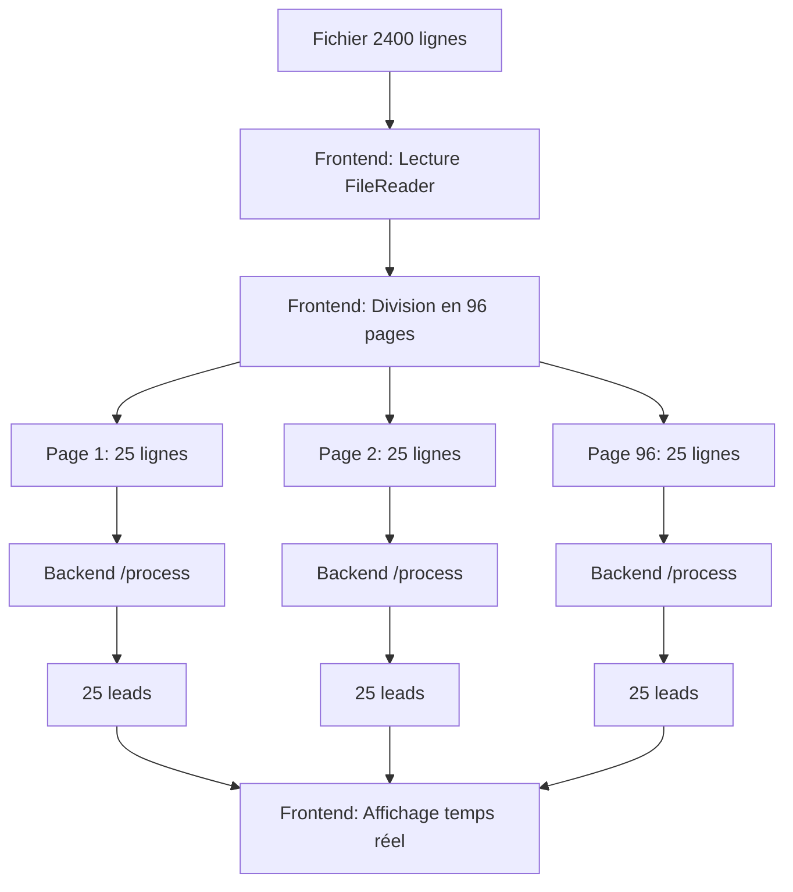

# 🔥 **Architecture Pagination Frontend** 

## 🎯 **Nouvelle Approche : Pagination 100% Frontend**

### ✅ **Ce qui a changé**

**AVANT** (Problématique) :
```
Frontend → Backend /process-paginated (avec erreurs 500)
```

**MAINTENANT** (Solution) :
```
Frontend → Divise fichier en pages → Backend /process (stable)
```

## 🏗 **Architecture Détaillée**

### **1️⃣ Lecture côté Frontend**
```javascript
// Le frontend lit le fichier entier
const fileContent = await new Promise<string>((resolve, reject) => {
  const reader = new FileReader();
  reader.onload = (e) => resolve(e.target?.result as string);
  reader.readAsText(file);
});
```

### **2️⃣ Division en pages côté Frontend**
```javascript
// Divise en pages de 25 lignes
const lines = fileContent.split('\n');
const headerLine = lines[0];
const dataLines = lines.slice(1).filter(line => line.trim());

const pageSize = 25;
const totalPages = Math.ceil(dataLines.length / pageSize);
```

### **3️⃣ Création de mini-fichiers**
```javascript
// Pour chaque page, créer un mini-fichier
for (let currentPage = 1; currentPage <= totalPages; currentPage++) {
  const startIndex = (currentPage - 1) * pageSize;
  const endIndex = Math.min(startIndex + pageSize, totalRows);
  const pageLines = dataLines.slice(startIndex, endIndex);
  const pageContent = [headerLine, ...pageLines].join('\n');

  // Créer un mini-fichier pour cette page
  const pageBlob = new Blob([pageContent], { type: 'text/plain' });
  const pageFile = new File([pageBlob], `page_${currentPage}_${file.name}`);
}
```

### **4️⃣ Appels API séparés**
```javascript
// Chaque mini-fichier → Appel séparé à /process
const pageFormData = new FormData();
pageFormData.append('file', pageFile);

const response = await fetch('/api/file-processing/process', {
  method: 'POST',
  body: pageFormData
});
```

## 🚀 **Avantages de cette Architecture**

### ✅ **Stabilité**
- **Utilise `/process`** : Endpoint stable, testé, qui fonctionne
- **Pas de nouveaux bugs** : Évite l'erreur 500 de `/process-paginated`
- **Backend inchangé** : Pas besoin de corriger `processPageDirectlyWithOpenAI`

### ✅ **Performance**
- **Parallélisation possible** : Peut traiter plusieurs pages en parallèle
- **Timeout réduit** : Chaque appel traite seulement 25 lignes
- **Retry granulaire** : Peut retry page par page

### ✅ **Contrôle Frontend**
- **Affichage temps réel** : Leads ajoutés au fur et à mesure
- **Gestion d'erreurs** : Peut skiper pages en erreur et continuer
- **Progress précis** : `API Call 1/96`, `API Call 2/96`, etc.

## 📊 **Flux de Données**



## 🔧 **Configuration**

### **Paramètres Optimisés**
- **Page Size** : 25 lignes (équilibre vitesse/fiabilité)
- **Retry** : 2 tentatives par page avec délai 2s
- **Pause** : 1000ms entre appels (évite surcharge serveur)
- **Max Failures** : Arrêt après 5 échecs consécutifs

### **Gestion d'Erreurs**
```javascript
// Si une page échoue → Skip et continue
if (!pageResponse.ok) {
  console.warn(`⚠️ API Call ${currentPage} failed, skipping...`);
  consecutiveFailures++;
  if (consecutiveFailures >= 5) break; // Arrêt si trop d'échecs
  continue; // Continue avec page suivante
}
```

## 📈 **Résultats Attendus**

### **Logs Frontend** :
```
🔄 Starting frontend-based paginated processing...
📄 File read successfully, splitting into pages...
📊 File analysis: 2400 total rows, 96 pages (25 rows per page)
📡 API Call 1: Processing page 1/96...
✅ API Call 1/96: +25 leads (Total: 25)
📡 API Call 2: Processing page 2/96...
✅ API Call 2/96: +25 leads (Total: 50)   // ← Plus d'erreur 500 !
📡 API Call 3: Processing page 3/96...
✅ API Call 3/96: +25 leads (Total: 75)
...
🎉 Processing completed: 96 API calls made, 2400 total leads
```

### **Logs Backend** :
```
📄 Processing file: page_1_filename.xlsx
✅ File processed successfully: 25 leads extracted
📄 Processing file: page_2_filename.xlsx  
✅ File processed successfully: 25 leads extracted
📄 Processing file: page_3_filename.xlsx
✅ File processed successfully: 25 leads extracted
```

## 🎯 **Comparaison Approches**

| Aspect | Backend Pagination | **Frontend Pagination** |
|--------|-------------------|------------------------|
| **Stabilité** | ❌ Erreur 500 | ✅ Stable |
| **Complexité Backend** | ❌ Nouveau code | ✅ Code existant |
| **Contrôle Frontend** | ❌ Limité | ✅ Total |
| **Debugging** | ❌ Difficile | ✅ Facile |
| **Performance** | ❌ Timeout | ✅ Rapide |

## 🚀 **Conclusion**

**Cette architecture résout définitivement le problème d'erreur 500 en utilisant l'endpoint stable `/process` avec une pagination intelligente côté frontend.**

**Résultat** : 
- ✅ **Pas d'erreur 500**
- ✅ **Affichage temps réel** 
- ✅ **Traitement complet des 2400 lignes**
- ✅ **Architecture robuste et maintenable**
